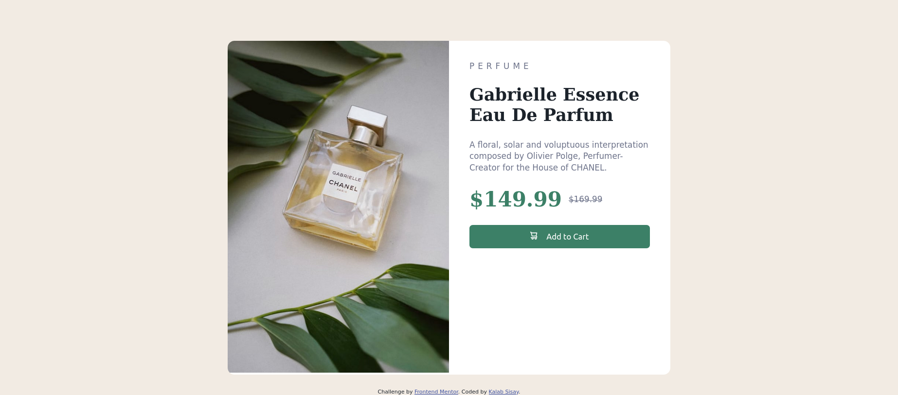

# Frontend Mentor - Product preview card component solution

This is a solution to the [Product preview card component challenge on Frontend Mentor](https://www.frontendmentor.io/challenges/product-preview-card-component-GO7UmttRfa). Frontend Mentor challenges help you improve your coding skills by building realistic projects.

## Table of contents

- [Frontend Mentor - Product preview card component solution](#frontend-mentor---product-preview-card-component-solution)
  - [Table of contents](#table-of-contents)
  - [Overview](#overview)
    - [The challenge](#the-challenge)
    - [Screenshot](#screenshot)
    - [Links](#links)
  - [My process](#my-process)
    - [Built with](#built-with)
    - [What I learned](#what-i-learned)
    - [Continued development](#continued-development)
      - [Issues](#issues)
      - [I want to learn more about this things](#i-want-to-learn-more-about-this-things)
  - [Author](#author)

## Overview

### The challenge

Users should be able to:

- View the optimal layout depending on their device's screen size
- See hover and focus states for interactive elements

### Screenshot



### Links

- Solution URL: [style](../product-preview-card-component-main/style.css)

## My process

### Built with

- Semantic HTML5 markup
- CSS custom properties
- Flexbox
- CSS Grid

### What I learned

- played a little bit with aspect ratio
- using `@font-face` to add fonts

To see how you can add code snippets, see below:

```css
@font-face {
  font-family: "Montserrat";
  src: url(https://fonts.google.com/specimen/Montserrat);
  font-weight: 500, 700;
}
```

### Continued development

#### Issues

- small details (font-sizes, weight, padding ...)

#### I want to learn more about this things

- **Setting dynamic size on elements**
  I didn't want to set a height (fixed or dynamic) on the card I wanted it to be based on the size of the content of product-info but the image streches the card even though I have a `max-width: 100%` on the image.
  Tried `max-height: 100%` on the image but that didn't work as well as the image has the bigger height and ther was no size set on the sibling or parent component.
- **Getting better at responsive design**
  I struggle with respoonsive design I want to get better at it.

## Author

- Frontend Mentor - [@KalabSisaySE](https://www.frontendmentor.io/profile/KalabSisaySE)
- Twitter - [@kalab*sisay*](https://www.twitter.com/kalab_sisay_)
